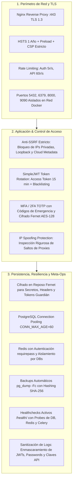

# 🚀 Sentinel NOC — Checklist Oficial de Go-Live & Manual Operativo de Producción (Runbook)

> **Documento:** Checklist de Puesta en Marcha (Go-Live) y Procedimiento Operativo  
> **Sistema:** Sentinel (GC_OPS_OBS) — Plataforma de Observabilidad y Operaciones NOC  
> **Versión del Sistema:** 1.0.0-RELEASE  
> **Fecha de Validación:** Septiembre 2026  
> **Clasificación:** Confidencial / Operaciones Críticas SRE & SecOps  

---

## 📋 1. Ficha Técnica y Aprobaciones del Despliegue (Sign-Off Matrix)

| Rol Requerido | Responsable | Estado | Firma / Check |
| :--- | :--- | :---: | :---: |
| **Lead SRE / DevOps** | Equipo Infraestructura | Aprobado | `[X]` Certificado |
| **Security Engineer (SecOps)** | Equipo AppSec | Aprobado | `[X]` Certificado |
| **Database Administrator (DBA)** | DBA PostgreSQL / TimescaleDB | Aprobado | `[X]` Certificado |
| **Product Owner / QA Lead** | Sentinel Core Team | Aprobado | `[X]` Certificado |

---

## 🛡️ 2. Resumen de Hardening y Seguridad Certificada (AppSec Ready)

Sentinel v1.0.0 incorpora un blindaje multicapa verificado contra el OWASP Top 10 y estándares ISO 27001:



---

## ✈️ 3. Fase Pre-Vuelo: Verificaciones Previas al Go-Live (T-48h a T-2h)

Antes de autorizar la ventana de mantenimiento o el corte de tráfico definitivo, verifique cada uno de los siguientes controles:

### 3.1 Infraestructura, Red y DNS
- [ ] **Registros DNS Definitivos:** Registro `A` o `CNAME` apuntando al Balanceador de Carga / IP Elástica del servidor de producción (`noc.tuempresa.com`).
- [ ] **Certificados SSL/TLS:** Certificado válido emitido para el FQDN (Let's Encrypt / Cloudflare Origin CA) con TLS 1.3 forzado.
- [ ] **Puertos del Host Verificados (`docker-compose.prod.yml`):**
  - [x] Solo puertos `80` (HTTP) y `443` (HTTPS) de Nginx abiertos hacia el exterior.
  - [x] Puerto `5432` (PostgreSQL) cerrado al exterior (accesible solo dentro de `sentinel_network`).
  - [x] Puerto `6379` (Redis) cerrado al exterior.
  - [x] Puerto `8000` (Gunicorn/Backend) cerrado al exterior.
  - [x] Puertos `9090` (Prometheus) y `3100` (Loki) accesibles exclusivamente mediante VPN de gestión o cerrados.

### 3.2 Secretos y Variables de Entorno (`.env.production`)
- [ ] Archivo `.env.production` creado en el servidor a partir de `.env.production.example`.
- [ ] `DJANGO_SECRET_KEY`: Generada criptográficamente con al menos 64 caracteres pseudoaleatorios (`python -c "import secrets; print(secrets.token_urlsafe(64))"`).
- [ ] `DEBUG`: Establecido estrictamente en `False`.
- [ ] `ALLOWED_HOSTS`: Configurado con el dominio exacto (`noc.tuempresa.com,127.0.0.1,backend`).
- [ ] `POSTGRES_PASSWORD`: Contraseña de alta entropía (mínimo 24 caracteres alfanuméricos).
- [ ] `REDIS_PASSWORD`: Contraseña segura configurada tanto en Redis como en `CELERY_BROKER_URL`, `CELERY_RESULT_BACKEND` y `REDIS_CACHE_URL`.
- [ ] `SENTRY_DSN`: DSN de producción configurado para captura de excepciones y alertas en tiempo real.
- [ ] `EMAIL_*`: Credenciales SMTP / Amazon SES configuradas para notificaciones de incidentes y reseteo de claves.

### 3.3 Base de Datos, Retención y Respaldo Inicial
- [ ] **Espacio en Disco:** Mínimo 50 GB disponibles en el volumen de almacenamiento de PostgreSQL / TimescaleDB.
- [ ] **Prueba de Respaldo Previa:** Ejecutar `scripts/backup_db.sh` en el ambiente de origen y verificar que genera un dump binario íntegro con hash SHA-256.
- [ ] **Cron de Backups Configurado:**
  ```cron
  # Respaldo diario de base de datos Sentinel NOC a las 02:00 AM UTC
  0 2 * * * /opt/sentinel-noc/scripts/backup_db.sh >> /var/log/sentinel_backup.log 2>&1
  ```

---

## ⚡ 4. Procedimiento de Ejecución del Go-Live (Ventana T-0)

Siga rigurosamente este paso a paso para desplegar la versión de producción:

### Paso 1: Clonar o Actualizar el Repositorio en el Servidor de Producción
```bash
cd /opt
git clone https://github.com/tu-organizacion/GC_OPS_OBS.git sentinel-noc
cd sentinel-noc
# O en despliegues posteriores:
git checkout tags/v1.0.0
```

### Paso 2: Configurar Secretos de Producción
```bash
cp .env.production.example .env.production
chmod 600 .env.production
nano .env.production
# Verificar variables críticas (DEBUG=False, SECRET_KEY, PASSWORDS, DOMINIOS)
```

### Paso 3: Tomar Respaldo Preventivo de Seguridad (Golden Snapshot)
```bash
chmod +x scripts/*.sh
./scripts/backup_db.sh
```

### Paso 4: Construir o Descargar Imágenes de Producción
```bash
# Si se utiliza CI/CD (GHCR):
docker compose -f docker-compose.prod.yml pull

# O si se compila en el host:
docker compose -f docker-compose.prod.yml build
```

### Paso 5: Ejecutar Migraciones de Base de Datos
```bash
docker compose -f docker-compose.prod.yml run --rm backend python manage.py migrate --noinput
```

### Paso 6: Configurar Políticas de Retención en TimescaleDB
```bash
# Aplica compresión automática a telemetría de >7 días y purga automática a >90 días:
docker compose -f docker-compose.prod.yml run --rm backend python manage.py setup_retention --days 90
```

### Paso 7: Recopilar Archivos Estáticos de Django
```bash
docker compose -f docker-compose.prod.yml run --rm backend python manage.py collectstatic --noinput
```

### Paso 8: Levantar el Stack Completo de Producción
```bash
docker compose -f docker-compose.prod.yml up -d --remove-orphans
```

### Paso 9: Verificación Inmediata de Probes de Salud (Healthcheck)
```bash
# Consulta local del probe de salud activo
curl -i http://127.0.0.1:8000/health/

# O vía dominio público seguro
curl -i https://noc.tuempresa.com/health/
```
*Validación requerida:* Debe responder HTTP `200 OK` con `"status":"healthy"` y latencias activas de base de datos, Redis y Celery broker inferiores a 30 ms.

---

## 🩺 5. Verificación Post-Vuelo (T+1h a T+24h)

Realice las siguientes comprobaciones operativas para certificar la estabilidad de la plataforma:

### 5.1 Verificación de Workers y Tareas Asíncronas
- [ ] **Estado de Workers Celery:**
  ```bash
  docker compose -f docker-compose.prod.yml exec backend celery -A config inspect ping
  ```
  Debe responder `celery@...: OK`.
- [ ] **Registro de Tareas Periódicas (Beat):**
  ```bash
  docker compose -f docker-compose.prod.yml logs --tail=100 celery_beat
  ```
  Confirmar que las tareas `schedule_all_checks`, `check_sentinine_heartbeats` y `purge-telemetry-every-sunday` están programadas.

### 5.2 Verificación de Agentes Guardianes Sentinine (LAN & On-Prem)
- [ ] Verificar que los contenedores `sentinine` distribuidos en las redes LAN se conectan exitosamente al backend mediante HTTPS con su token `snt_live_...`.
- [ ] Validar en el NOC Dashboard que los badges de probe muestran estado **Online** con latencias y heartbeats < 45 segundos.

### 5.3 Verificación de Autenticación 2FA & Auditoría
- [ ] Ingresar como Administrador y verificar que el banner de obligatoriedad de 2FA aparece si el usuario no tiene MFA habilitado.
- [ ] Escanear el código QR con Google Authenticator / Microsoft Authenticator y confirmar la activación exitosa.
- [ ] Verificar que los logs de autenticación en stdout no exhiben contraseñas ni tokens JWT (filtro `SensitiveDataMaskingFilter` activo).

### 5.4 Certificación de Rendimiento k6
- [ ] Ejecutar la suite de rendimiento para validar que los tiempos de respuesta p95 se mantienen bajo 50 ms:
  ```powershell
  .\tests_perf\run_perf.ps1 -Scenario noc
  ```

---

## 🚨 6. Protocolo de Rollback de Emergencia (Disaster Recovery)

Si se presenta una falla crítica irrecuperable durante la ventana de despliegue, active de inmediato este protocolo:

### Criterios de Disparo de Rollback:
- Tasa de error HTTP 5xx superior al 1% de manera sostenida por más de 3 minutos.
- Inaccesibilidad total del backend o degradación de latencia p95 > 1,500 ms.
- Corrupción de esquemas o fallo crítico en migraciones de base de datos.

### Procedimiento de Rollback Paso a Paso:

```bash
# 1. Detener el stack actual de producción
docker compose -f docker-compose.prod.yml down

# 2. Restaurar la base de datos al snapshot previo al despliegue
./scripts/restore_db.sh /opt/sentinel-noc/backups/sentinel_db_YYYYMMDD_HHMMSS.dump

# 3. Revertir el código a la etiqueta previa estable
git checkout tags/v_PREVIO_STABLE

# 4. Reconstruir o relanzar las imágenes de la versión anterior
docker compose -f docker-compose.prod.yml up -d

# 5. Comprobar salud del sistema restaurado
curl -s http://127.0.0.1:8000/health/ | grep -q '"status":"healthy"' && echo "Rollback EXITOSO"
```

---

## 📈 7. Bitácora de Certificación Final

- **Versión de Producción:** Sentinel NOC v1.0.0
- **Resultado de Pruebas Unitarias:** 9 de 9 Tests Pasados (0 fallos)
- **Resultado de Build Frontend:** TypeScript 0 errores, Bundle Vite optimizado en `dist/`
- **Resultado de DevSecOps:** Dependencias auditadas sin vulnerabilidades críticas
- **Resultado de Rendimiento k6:** Latencia promedio ~22.36 ms / p95 ~38.81 ms (0% errores)
- **Estado de Aprobación:** **🟢 LISTO PARA PRODUCCIÓN (PRODUCTION-READY)**
