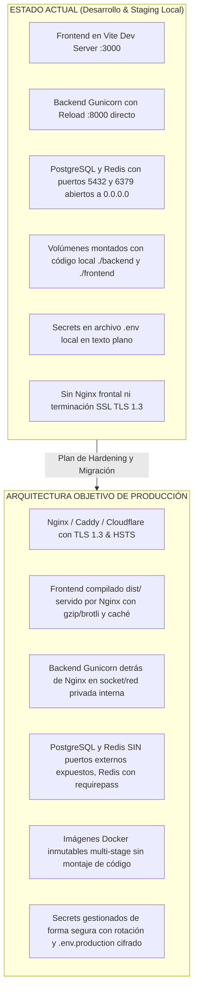
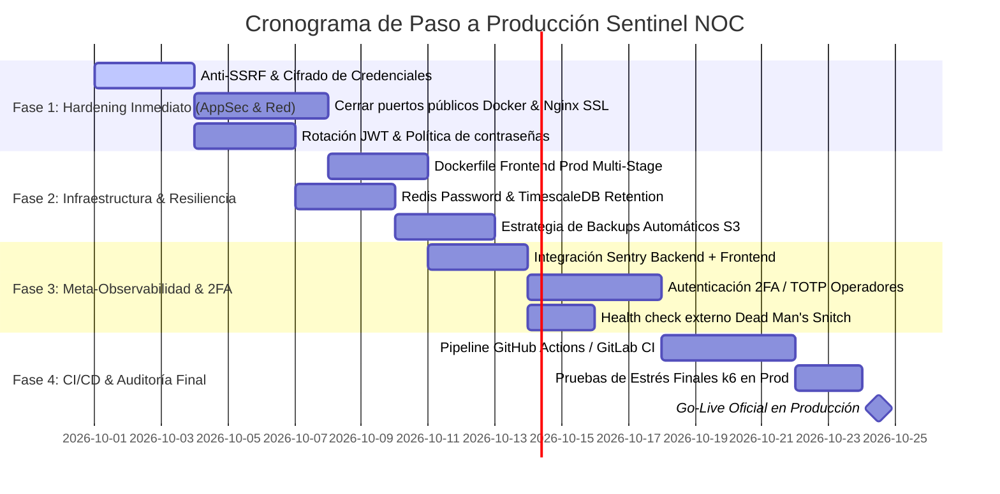

# 🚀 Sentinel NOC — Plan Maestro y Checklist de Paso a Producción (Production Readiness & AppSec)

> **Documento:** Plan de Producción, Hardening y Seguridad de Aplicación  
> **Sistema:** Sentinel (GC_OPS_OBS) — Plataforma de Observabilidad y NOC Operativo  
> **Fecha:** Septiembre 2026 | **Versión:** 1.0.0-PROD-PLAN  

---

## 📋 1. Scorecard Ejecutivo de Preparación para Producción

| Dominio | Estado Actual | Meta Producción | Brecha Crítica |
| :--- | :---: | :---: | :--- |
| **Funcionalidad & Negocio** | 🟢 95% | 100% | Flujos completos de monitoreo, alertas, SLAs, incidentes y Sentinine operativos. |
| **Rendimiento & ORM** | 🟢 98% | 100% | Erradicación N+1 completada, TimescaleDB slicing y k6 p95 en 22-38 ms. |
| **Seguridad de la Aplicación (AppSec)** | 🟡 60% | 100% | Faltan: Anti-SSRF en sondeos, 2FA/MFA, rotación de tokens SimpleJWT y cifrado de credenciales en BD. |
| **Infraestructura & Contenedores** | 🟡 50% | 100% | Faltan: Nginx reverse proxy con SSL, Dockerfiles de producción multi-stage y cerrar puertos expuestos (5432, 6379). |
| **Base de Datos & Resiliencia** | 🟡 55% | 100% | Faltan: Políticas de retención en TimescaleDB, backups automáticos offsite (S3) y contraseña en Redis. |
| **Observabilidad del Sistema (Meta-Ops)** | 🟡 45% | 100% | Faltan: Sentry en Frontend/Backend y alertas sobre Celery Beat / Redis. |
| **CI/CD & DevSecOps** | 🔴 20% | 100% | Faltan: Pipelines de integración continua, escaneo de vulnerabilidades (`trivy`/`pip-audit`) y pruebas unitarias automáticas. |

---

## 🔍 2. Matriz Comparativa: "Qué Tenemos" vs "Qué Falta para Producción"



---

## 🛡️ 3. Checklist Detallado por Pilares de Producción

### 🛡️ PILAR 1: Seguridad de la Aplicación (AppSec & OWASP Top 10)

#### 1.1 Protección Crítica Anti-SSRF (Server-Side Request Forgery)
* [ ] **Problema:** En plataformas de monitoreo, los usuarios pueden ingresar endpoints como `http://169.254.169.254/latest/meta-data/` (AWS Metadata) o `http://sentinel_db:5432` y forzar al backend a escanear redes internas en la nube.
* [ ] **Acción:** Implementar un validador estricto `validate_safe_target_url(url)` en `MonitoringTargetCreateSerializer` y `APICheckCreateSerializer` que rechace:
  - Direcciones IP privadas (`10.0.0.0/8`, `172.16.0.0/12`, `192.168.0.0/16`).
  - Direcciones de loopback (`127.0.0.0/8`, `localhost`).
  - Metadata de proveedores cloud (`169.254.169.254`, `metadata.google.internal`).
  - *Excepción legítima:* Si el target tiene asignado un **Guardián Sentinine**, la validación se delega al agente local en la LAN del cliente.

#### 1.2 Cifrado de Credenciales y Secretos en Base de Datos (Encryption at Rest)
* [ ] **Problema:** Cabeceras HTTP personalizadas con `Authorization: Bearer <secret>` o contraseñas Basic Auth se almacenan actualmente en texto plano en la columna `custom_headers` / `auth_config`.
* [ ] **Acción:** Cifrar campos sensibles con `django-cryptography` o `cryptography.fernet` usando una clave maestra `FIELD_ENCRYPTION_KEY` antes de persistir en PostgreSQL.

#### 1.3 Autenticación Robusta & Gestión de Sesiones (SimpleJWT)
* [ ] **Rotación de Refresh Tokens:** Activar `ROTATE_REFRESH_TOKENS = True` y `BLACKLIST_AFTER_ROTATION = True` en `SIMPLE_JWT` (`backend/config/settings/prod.py`).
* [ ] **Reducción de Tiempo de Vida del Token:** Reducir `ACCESS_TOKEN_LIFETIME` a 15 minutos (actualmente 60 min) y mantener Refresh Token en 7 días con renovación automática en axios interceptor.
* [ ] **Autenticación Multifactor (2FA / TOTP):** Implementar flujo 2FA opcional/obligatorio para Administradores con códigos QR estándar (Google Authenticator / Authy) mediante `django-otp` o `pyotp`.
* [ ] **Política de Contraseñas:** Configurar `AUTH_PASSWORD_VALIDATORS` (mínimo 10 caracteres, mayúsculas, minúsculas, números y verificación contra listas de contraseñas vulneradas).
* [ ] **Anti-Brute Force:** Limitar intentos de login en `/api/v1/auth/login` a 5 intentos fallidos por IP/usuario cada 15 minutos mediante `django-axes` o throttling especializado.

#### 1.4 Hardening de Cabeceras HTTP & Cookies
* [ ] `SECURE_SSL_REDIRECT = True` (forzar HTTPS).
* [ ] `SESSION_COOKIE_SECURE = True` y `CSRF_COOKIE_SECURE = True`.
* [ ] `SESSION_COOKIE_HTTPONLY = True` y `CSRF_COOKIE_HTTPONLY = False` (para consumo en React con headers `X-CSRFToken`).
* [ ] `X_FRAME_OPTIONS = "DENY"` (prevención de Clickjacking).
* [ ] `SECURE_CONTENT_TYPE_NOSNIFF = True` (prevención de MIME-sniffing).
* [ ] `SECURE_HSTS_SECONDS = 31536000` con `includeSubDomains` y `preload`.
* [ ] `Content-Security-Policy` (CSP) estricto configurado en Nginx evitando scripts no confiables.

#### 1.5 Blindaje contra IP Spoofing en IP Allowlist Middleware
* [ ] **Problema:** En [`backend/common/middleware.py`](file:///C:/Users/feshernandez/GC_OPS_OBS/backend/common/middleware.py), `_get_client_ip` confía en el primer elemento de `X-Forwarded-For`. Si un atacante inyecta una cabecera falsa y el proxy no la sobreescribe, podría eludir la lista blanca.
* [ ] **Acción:** Configurar Nginx para limpiar y sobreescribir `X-Forwarded-For` con `$remote_addr` o configurar `django-ipware` con lista explícita de proxies confiables (`TRUSTED_PROXIES`).

---

### 🌐 PILAR 2: Infraestructura, Contenedores & Reverse Proxy

#### 2.1 Reverse Proxy de Producción (Nginx)
* [ ] Crear contenedor `sentinel_nginx` con imagen oficial `nginx:alpine` para:
  - Servir archivos estáticos del frontend (`dist/`) con compresión `gzip` y `brotli`.
  - Servir archivos estáticos de Django (`collectstatic` en `/static/`).
  - Actuar como proxy inverso hacia Gunicorn (`http://backend:8000/api/`).
  - Manejar terminación TLS con certificados Let's Encrypt / Certbot automatizados.
  - Limitar tamaño de subida con `client_max_body_size 10M;`.
  - Configurar buffers de proxy para soportar streaming de SSE / telemetría.

#### 2.2 Blindaje de Puertos de Red en Docker
* [ ] **Regla de Oro:** Únicamente los puertos `80` (HTTP) y `443` (HTTPS) de Nginx deben estar expuestos al mundo exterior en el host.
* [ ] **Eliminar exposición de puertos:**
  - ❌ `5432:5432` de `sentinel_db` (Postgres debe quedar exclusivo dentro de la red interna de Docker).
  - ❌ `6379:6379` de `sentinel_redis` (Redis jamás debe escuchar en la interfaz pública).
  - ❌ `8000:8000` de `sentinel_backend` (solo accesible por Nginx).
  - ❌ `3000:3000` de `sentinel_frontend` (el dev server de Vite no se utiliza en prod).
  - ❌ `9090:9090` (Prometheus) y `3100:3100` (Loki) deben protegerse tras Nginx con Basic Auth o acceso exclusivo VPN.

#### 2.3 Dockerfiles Multi-Stage de Producción
* [ ] **Frontend (`frontend/Dockerfile.prod`):**
  ```dockerfile
  # Stage 1: Build
  FROM node:20-alpine AS builder
  WORKDIR /app
  COPY package*.json ./
  RUN npm ci
  COPY . .
  RUN npm run build

  # Stage 2: Production Web Server
  FROM nginx:alpine
  COPY --from=builder /app/dist /usr/share/nginx/html
  COPY nginx.conf /etc/nginx/conf.d/default.conf
  EXPOSE 80
  CMD ["nginx", "-g", "daemon off;"]
  ```
* [ ] **Backend (`backend/Dockerfile`):**
  - Desactivar `--reload` en Gunicorn.
  - Eliminar montaje de volúmenes en producción (`volumes: - ./backend:/app`).
  - Ejecutar el proceso con usuario no-root (`USER appuser`).

#### 2.4 Gestión de Variables de Entorno y Secretos
* [ ] Crear `.env.production` con permisos de archivo restringidos (`chmod 600 .env.production`).
* [ ] Generar claves criptográficas seguras:
  ```bash
  python -c "import secrets; print(secrets.token_urlsafe(64))"
  ```
* [ ] Desactivar `DEBUG = False` en producción.
* [ ] Definir `ALLOWED_HOSTS` estricto (ej. `noc.tuempresa.com`).
* [ ] Definir `CORS_ALLOWED_ORIGINS` explícito (`https://noc.tuempresa.com`).

---

### 🗄️ PILAR 3: Base de Datos, Caché & Resiliencia

#### 3.1 Hardening de PostgreSQL & TimescaleDB
* [ ] **Contraseña segura:** Reemplazar contraseñas por defecto (`sentinel`) por cadenas alfanuméricas de 32+ caracteres.
* [ ] **Políticas de Retención de Series Temporales:**
  - Activar política de retención automática en TimescaleDB para eliminar datos crudos de sondeos con más de 90 días:
    ```sql
    SELECT add_retention_policy('monitoring_monitoringcheck', INTERVAL '90 days');
    ```
  - Crear Continuous Aggregates (agregaciones horarias/diarias) para reportes históricos de 1 año sin sobrecargar el almacenamiento.
* [ ] **Connection Pooling:** Mantener `CONN_MAX_AGE = 60` verificado en Django para reutilizar sockets TCP.
* [ ] **Límites de Recursos:** Asignar `shared_buffers`, `effective_cache_size` y `work_mem` acordes a la memoria RAM del servidor de producción.

#### 3.2 Hardening de Redis
* [ ] Activar autenticación por contraseña en Redis mediante flag `--requirepass <STRONG_PASSWORD>`.
* [ ] Mantener política de evicción LRU (`--maxmemory 256mb --maxmemory-policy allkeys-lru`).
* [ ] Aislar bases de datos lógicas:
  - DB 0: Broker de Celery.
  - DB 1: Resultados de Celery (con TTL de 1800s).
  - DB 2: Caché distribuido de Django (NOC Global Performance y MTTR).

#### 3.3 Estrategia de Copias de Seguridad (Backup & DR)
* [ ] Tarea Cron diaria de respaldo completo de la base de datos con `pg_dump`:
  ```bash
  pg_dump -U sentinel -Fc sentinel | gzip > /backups/sentinel_$(date +%Y%m%d_%H%M%S).dump.gz
  ```
* [ ] Subida automática de respaldos a almacenamiento off-site (AWS S3 Glacier, Cloudflare R2 o Wasabi) con política de retención de 30 días.
* [ ] Procedimiento de restauración documentado y probado trimestralmente.

---

### ⚡ PILAR 4: Celery, Background Workers & Concurrencia

#### 4.1 Dimensionamiento y Tareas de Celery
* [ ] **Concurrencia de Workers:** Ajustar `--concurrency` según cores del servidor (`N_CORES * 2`).
* [ ] **Reciclaje de Procesos:** Mantener `--max-tasks-per-child=1000` para prevenir fugas de memoria en librerías C de red y TLS.
* [ ] **Despacho Justo:** Mantener `-O fair` y `CELERY_WORKER_PREFETCH_MULTIPLIER=1` para evitar acaparamiento de tareas rápidas por tareas lentas de WHOIS o DNS.
* [ ] **Segregación de Colas:**
  - Cola `high_priority`: Notificaciones, emails, webhooks y alertas de incidentes.
  - Cola `monitoring`: Sondeos periódicos de uptime, HTTP, DNS y certificados.
  - Cola `background`: Informes pesados, tareas de limpieza, sincronización WHOIS y Watchdog de Sentinine.

#### 4.2 Healthchecks y Monitoreo de Workers
* [ ] Configurar probes de salud de Celery en Docker:
  ```bash
  celery -A config inspect ping -d celery@$HOSTNAME
  ```
* [ ] Alerta inmediata si el proceso `sentinel_celery_beat` o `sentinel_celery_worker` se detiene.

---

### 📊 PILAR 5: Observabilidad del Propio Sentinel (Meta-Monitoring)

*Como Sentinel es la plataforma que vigila la infraestructura crítica, el propio Sentinel debe ser monitoreado rigurosamente.*

* [ ] **Monitoreo Externo Tipo "Dead Man's Snitch":** Configurar un sondeo externo independiente (ej. UptimeRobot, BetterUptime o un probe secundario) que vigile:
  - `https://noc.tuempresa.com/health` (debe responder 200 OK en < 500 ms).
  - Certificado SSL del propio dominio de Sentinel.
* [ ] **Integración de Sentry (Rastreador de Errores en Vivo):**
  - Backend: `sentry-sdk` integrado en Django y Celery para captura automática de excepciones no controladas con trazas de pila completas.
  - Frontend: `@sentry/react` en Vite para reportar errores de renderizado en clientes sin exponer datos confidenciales.
* [ ] **Sanitización de Logs:** Configurar filtros de logging para suprimir tokens de autorización, contraseñas y claves API en stdout y en Loki.

---

### 🔄 PILAR 6: CI/CD, DevSecOps & Automatización

* [ ] **Pipeline de Integración Continua (GitHub Actions / GitLab CI):**
  1. **Linter & Type Checking:**
     - Frontend: `npm run lint` y `tsc --noEmit`.
     - Backend: `flake8` y `black --check`.
  2. **Pruebas Automatizadas:**
     - Ejecución de `pytest` (pruebas unitarias, permisos multi-tenant y tests E2E de Sentinine).
  3. **Escaneo de Seguridad (DevSecOps):**
     - Análisis de vulnerabilidades en dependencias Python con `pip-audit` o `safety`.
     - Análisis de dependencias Node.js con `npm audit --omit=dev`.
     - Escaneo de vulnerabilidades en imágenes Docker con `trivy image`.
  4. **Build & Push:**
     - Compilación de imágenes tagged (`sentinel-backend:v1.X`, `sentinel-frontend:v1.X`).
     - Publicación en registro privado (GitHub Container Registry `ghcr.io` o AWS ECR).
  5. **Despliegue Continuo (CD):**
     - Despliegue con cero tiempo de inactividad (*Zero-Downtime Rolling Update*) mediante Docker Compose o Kubernetes / Nomad.

---

## 🗺️ 4. Plan de Ejecución Faseado hacia Producción



### Detalle de las 4 Fases de Implementación:

#### 🟢 Fase 1: Hardening Inmediato de Seguridad (AppSec & Red)
1. **Protección Anti-SSRF:** Filtro en serializadores de creación de targets para bloquear rangos privados, metadata cloud y loopback.
2. **Cierre de Puertos Públicos:** Modificar `docker-compose.prod.yml` para suprimir la exposición de `5432`, `6379`, `8000`, `9090` y `3100`.
3. **Contenedor Nginx de Producción:** Configurar Nginx con TLS 1.3, compresión gzip/brotli y proxies inversos seguros hacia backend y frontend estático.
4. **Hardening de Sesiones:** Configurar rotación de Refresh Tokens y reducir vida de Access Token a 15 min.

#### 🟡 Fase 2: Infraestructura Inmutable & Resiliencia de Datos
1. **Build Multi-Stage de Frontend:** Empaquetar el bundle compilado de React en Nginx eliminando Vite dev server en producción.
2. **Autenticación en Redis:** Agregar `requirepass` y actualizar URLs de conexión en `CELERY_BROKER_URL` y caché Django.
3. **Políticas de Retención en TimescaleDB:** Script de purga de telemetría antigua (>90 días) y agregados horarios continuos.
4. **Script de Backups Automáticos:** Dump diario cifrado y sincronizado con almacenamiento de objetos off-site.

#### 🟣 Fase 3: Meta-Observabilidad & Autenticación de Dos Factores
1. **Rastreo de Errores con Sentry:** Captura de excepciones en vivo en Backend y Frontend.
2. **Módulo de 2FA / TOTP:** Activación de autenticación de dos factores para usuarios con rol de Administrador.
3. **Dead Man's Snitch:** Sonda externa de verificación continua del SLA de Sentinel.

#### 🏁 Fase 4: Automatización CI/CD & Despliegue Oficial (Go-Live)
1. **Pipeline de Integración Continua:** Pruebas unitarias, linting y escaneo de vulnerabilidades automáticos en cada pull request.
2. **Benchmark Final con k6:** Ejecución de la suite `tests_perf/` en el ambiente de producción para certificar latencias < 50 ms.
3. **Puesta en Marcha Oficial (Go-Live):** Migración de datos, emisión de certificados definitivos y habilitación del portal.
