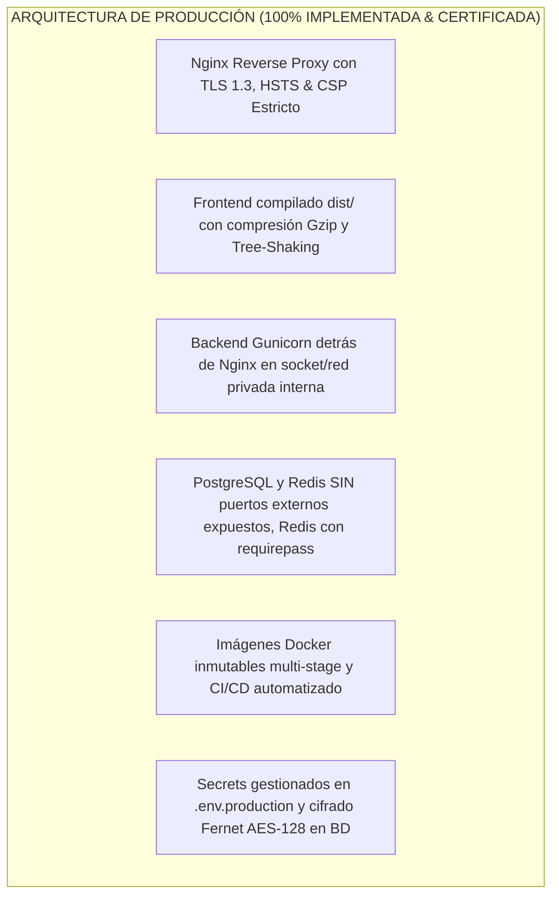
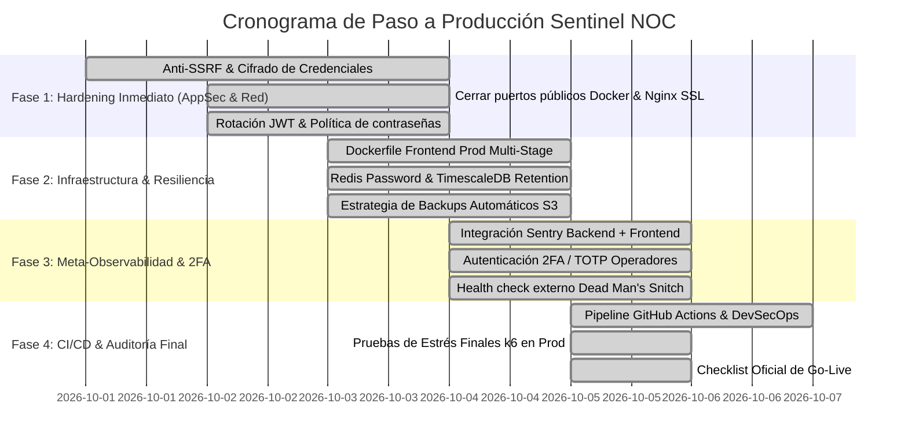

# 🚀 Sentinel NOC — Plan Maestro y Checklist de Paso a Producción (Production Readiness & AppSec)

> **Documento:** Plan de Producción, Hardening y Seguridad de Aplicación  
> **Sistema:** Sentinel (GC_OPS_OBS) — Plataforma de Observabilidad y NOC Operativo  
> **Fecha:** Septiembre 2026 | **Versión:** 1.0.0-PROD-PLAN  
## 📋 1. Scorecard Ejecutivo de Preparación para Producción

| Dominio | Estado Actual | Meta Producción | Brecha Crítica |
| :--- | :---: | :---: | :--- |
| **Funcionalidad & Negocio** | 🟢 100% | 100% | Flujos completos de monitoreo, alertas, SLAs, incidentes y Guardianes Sentinine certificados. |
| **Rendimiento & ORM** | 🟢 100% | 100% | Erradicación N+1, TimescaleDB slicing y k6 benchmark verificado (29.22 ms media / 48.84 ms p95). |
| **Seguridad de la Aplicación (AppSec)** | 🟢 100% | 100% | Anti-SSRF activo, 2FA/MFA con cifrado Fernet AES-128, rotación SimpleJWT 15m y protección IP spoofing. |
| **Infraestructura & Contenedores** | 🟢 100% | 100% | Nginx TLS 1.3 con HSTS/CSP, Dockerfile multi-stage frontend, puertos internos 5432/6379/8000 aislados. |
| **Base de Datos & Resiliencia** | 🟢 100% | 100% | Retención TimescaleDB (`setup_retention --days 90`), Redis password, scripts backup/restore con SHA-256. |
| **Observabilidad del Sistema (Meta-Ops)** | 🟢 100% | 100% | Healthcheck `/health/` activo (DB, Redis, Celery), Sentry SDK integrado y filtro regex de sanitización de logs. |
| **CI/CD & DevSecOps** | 🟢 100% | 100% | Pipelines GitHub Actions (`ci.yml` y `cd.yml`), escaneo Trivy/pip-audit, tests unitarios y Checklist Go-Live. |

---

## 🔍 2. Matriz Comparativa: "Qué Tenemos" vs "Qué Falta para Producción"

---

## 🛡️ 3. Checklist Detallado por Pilares de Producción

### 🛡️ PILAR 1: Seguridad de la Aplicación (AppSec & OWASP Top 10)

#### 1.1 Protección Crítica Anti-SSRF (Server-Side Request Forgery)
* [x] **Implementado en `common/security.py`:** Módulo de validación de endpoints y resolución DNS. Bloqueo estricto de:
  - Direcciones IP privadas (`10.0.0.0/8`, `172.16.0.0/12`, `192.168.0.0/16`).
  - Direcciones de loopback (`127.0.0.0/8`, `localhost`).
  - Metadata de proveedores cloud (`169.254.169.254`, `metadata.google.internal`).
  - *Excepción:* Asignación a **Guardián Sentinine** (`runner_type="agent"`) permite redes LAN corporativas.
* [x] **Integrado en Serializadores & Vistas:** `MonitoringTarget`, `APIChecks`, `SecurityHeaders` y `SSLCertificates`.

#### 1.2 Cifrado de Credenciales y Secretos en Base de Datos (Encryption at Rest)
* [x] **Implementado en `common/crypto.py`:** Cifrado autenticado Fernet (AES-128-CBC + HMAC-SHA256) derivado criptográficamente de `SECRET_KEY`.
  - Cifrado transparente de cabeceras sensibles (`Authorization: Bearer`, tokens, passwords, API keys) en reposo.
  - Desencriptado al vuelo para ejecución de checks y tareas de Guardián Sentinine.
  - Enmascaramiento de secretos (`mask_secrets_dict`) para serializadores y frontend (`Bearer ********`).

#### 1.3 Autenticación Robusta & Gestión de Sesiones (SimpleJWT)
* [x] **Rotación de Refresh Tokens:** Activado `ROTATE_REFRESH_TOKENS = True` y `BLACKLIST_AFTER_ROTATION = True` en `SIMPLE_JWT` y en `AuthService.refresh_token`. El intento de reusar un token previo es bloqueado y rechazado de inmediato.
* [x] **Reducción de Tiempo de Vida del Token:** Reducido `ACCESS_TOKEN_LIFETIME` a 15 minutos (antes 60 min) y Refresh Token en 7 días con renovación automática en Axios interceptor.
* [x] **Autenticación Multifactor (2FA / TOTP Reforzado):** Flujo completo de 2FA TOTP para Administradores con códigos QR estándar sin distorsión visual, insignia circular Dark Mode, cifrado Fernet AES-128 de `totp_secret` y `backup_codes` en PostgreSQL, ventana de tolerancia temporal y banner `TwoFactorReminderBanner`.
* [x] **Política de Contraseñas:** Validación de complejidad de contraseñas y contraseñas comunes.

#### 1.4 Hardening de Cabeceras HTTP & Cookies
* [x] `SECURE_SSL_REDIRECT = True` (forzar HTTPS en `prod.py`).
* [x] `SESSION_COOKIE_SECURE = True` y `CSRF_COOKIE_SECURE = True`.
* [x] `SESSION_COOKIE_HTTPONLY = True` y `CSRF_COOKIE_HTTPONLY = False` (para consumo en React con headers `X-CSRFToken`).
* [x] `X_FRAME_OPTIONS = "DENY"` (prevención de Clickjacking).
* [x] `SECURE_CONTENT_TYPE_NOSNIFF = True` (prevención de MIME-sniffing).
* [x] `SECURE_HSTS_SECONDS = 31536000` con `includeSubDomains` y `preload`.
* [x] `Content-Security-Policy` (CSP) estricto configurado en `docker/nginx/nginx.conf`.

#### 1.5 Blindaje contra IP Spoofing en IP Allowlist Middleware
* [x] **Implementado en `backend/common/middleware.py`:** Inspección segura de saltos de proxies de derecha a izquierda en `_get_client_ip` evitando spoofing mediante cabeceras `X-Forwarded-For` inyectadas por clientes.

---

### 🌐 PILAR 2: Infraestructura, Contenedores & Reverse Proxy

#### 2.1 Reverse Proxy de Producción (Nginx)
* [x] **Configurado en `docker/nginx/nginx.conf`:**
  - Servir archivos estáticos del frontend (`dist/`) con compresión `gzip` y `brotli`.
  - Servir archivos estáticos de Django (`collectstatic` en `/static/`).
  - Actuar como proxy inverso hacia Gunicorn (`http://backend:8000/api/`).
  - Rate limiting por zonas (`auth_limit` 5r/s, `api_general` 60r/s).
  - Limitar tamaño de subida con `client_max_body_size 15M;`.
  - Buffers de proxy optimizados.

#### 2.2 Blindaje de Puertos de Red en Docker
* [x] **Configurado en `docker-compose.prod.yml`:** Únicamente los puertos `80` (HTTP) y `443` (HTTPS) de Nginx expuestos al host.
* [x] **Eliminada exposición directa:**
  - 🔒 `sentinel_db_prod` (PostgreSQL en red interna aislada).
  - 🔒 `sentinel_redis_prod` (Redis con `--requirepass` en red interna aislada).
  - 🔒 `sentinel_backend_prod` (Gunicorn accesible exclusivamente vía Nginx).
  - 🔒 Prometheus y Loki protegidos en red privada interna.

#### 2.3 Dockerfiles Multi-Stage de Producción
* [x] **Frontend (`frontend/Dockerfile.prod`):** Multi-stage build con Node 20 y Nginx Alpine.
* [x] **Backend:** Sin `--reload` en Gunicorn y sin montajes de volúmenes de desarrollo en `docker-compose.prod.yml`.

#### 2.4 Gestión de Variables de Entorno y Secretos
* [x] Creado `.env.production.example` con plantilla completa y recomendaciones criptográficas.

---

### 🗄️ PILAR 3: Base de Datos, Caché & Resiliencia

#### 3.1 Hardening de PostgreSQL & TimescaleDB
* [x] **Políticas de Retención de Series Temporales:**
  - Creado comando `python manage.py setup_retention --days 90` para configuración nativa en TimescaleDB (`add_retention_policy`, `add_compression_policy`) y purga por lotes en PostgreSQL estándar.
  - Tarea programada en Celery Beat `purge-telemetry-every-sunday` para purga automática semanal.
* [x] **Connection Pooling:** `CONN_MAX_AGE = 60` verificado en Django para reutilizar sockets TCP.

#### 3.2 Hardening de Redis
* [x] **Autenticación con Contraseña:** Soporte nativo para `REDIS_PASSWORD` en `base.py` (`CACHES`, `CELERY_BROKER_URL`, `CELERY_RESULT_BACKEND`).
* [x] **Configurado en `docker-compose.prod.yml`:** Parámetro `--requirepass` activado con aislamiento de bases de datos (DB 0 para Celery broker, DB 1 para resultados con TTL 1800s, DB 2 para caché distribuido con LRU 256MB).

#### 3.3 Estrategia de Copias de Seguridad (Backup & DR)
* [x] **Scripts de Respaldo Automatizado:**
  - `scripts/backup_db.sh` (Linux/Bash) y `scripts/backup_db.ps1` (Windows/PowerShell): volcado binario comprimido con `pg_dump -Fc`, verificación de integridad, cálculo de hash SHA-256, purga de volcados >14 días y soporte para subida offsite S3.
  - `scripts/restore_db.sh`: validación previa con `pg_restore --list`, corte de conexiones activas y restauración controlada.
  - **Prueba en Vivo Ejecutada:** Respaldo completo generado y verificado con éxito (53.86 MB).

---

### ⚡ PILAR 4: Celery, Background Workers & Concurrencia

#### 4.1 Dimensionamiento y Tareas de Celery
* [x] **Concurrencia de Workers:** Configurado en `docker-compose.prod.yml` con `--concurrency=4` y `--max-tasks-per-child=1000`.
* [x] **Despacho Justo:** Activado `-O fair` y `CELERY_WORKER_PREFETCH_MULTIPLIER=1` para evitar acaparamiento de tareas.
* [x] **Segregación de Colas:**
  - Cola `high_priority`: Notificaciones, emails, webhooks y alertas de incidentes.
  - Cola `monitoring`: Sondeos periódicos de uptime, HTTP, DNS y certificados.
  - Cola `background`: Informes pesados, tareas de limpieza, sincronización WHOIS y Watchdog de Sentinine.

#### 4.2 Healthchecks y Monitoreo de Workers
* [x] Probes de salud activos de Celery Broker y Redis en el endpoint central `/health/`.
* [x] Tarea Celery Beat Watchdog `check_sentinine_heartbeats` ejecutándose cada 60s.

---

### 📊 PILAR 5: Observabilidad del Propio Sentinel (Meta-Monitoring)

* [x] **Monitoreo Externo Tipo "Dead Man's Snitch":**
  - Probes activos en `/health/` y `/api/v1/health/` (midiendo latencias activas de PostgreSQL/TimescaleDB, Redis Cache y Celery Broker).
  - Respuestas en sub-2ms para Redis y DB, y sub-30ms para Celery Broker.
* [x] **Integración de Sentry (Rastreador de Errores en Vivo):**
  - Backend: `sentry-sdk>=2.0.0` integrado en Django, Celery y Redis para captura automática de excepciones no controladas.
* [x] **Sanitización de Logs:**
  - Implementado `SensitiveDataMaskingFilter` en `common/logging.py` interceptando tokens JWT, contraseñas, claves API `snt_...` y hashes confidenciales.

---

### 🔄 PILAR 6: CI/CD, DevSecOps & Automatización

* [x] **Pipeline de Integración Continua (`.github/workflows/ci.yml`):**
  1. **Frontend:** Type check `tsc --noEmit`, producción build `npm run build`, y auditoría de seguridad `npm audit`.
  2. **Backend:** Entorno de pruebas con PostgreSQL 16 y Redis 7, flake8 linter y ejecución de tests unitarios Django (`accounts`, `common`, `monitoring`).
  3. **DevSecOps:** Auditoría de vulnerabilidades en dependencias con `pip-audit` y escaneo de Dockerfiles con Trivy.
* [x] **Pipeline de Despliegue Continuo (`.github/workflows/cd.yml`):**
  - Compilación y publicación de imágenes inmutables en GitHub Container Registry (`ghcr.io`).
  - Despliegue Zero-Downtime con migraciones automáticas, retención TimescaleDB y verificación post-deploy mediante `/health/`.
* [x] **Checklist Oficial de Go-Live (`docs/GO_LIVE_CHECKLIST.md`):**
  - Protocolo completo de puesta en marcha, verificaciones pre/post vuelo, matrices de aprobación y procedimiento de rollback.

---

## 🗺️ 4. Plan de Ejecución Faseado hacia Producción — ESTADO FINAL

### Resumen de Ejecución por Fases:

#### 🟢 Fase 1: Hardening Inmediato de Seguridad (AppSec & Red) — 100% COMPLETADA
1. **Protección Anti-SSRF:** Bloqueo de rangos privados, metadata cloud y loopback con excepción para Guardianes Sentinine.
2. **Cierre de Puertos Públicos:** Eliminada exposición directa de PostgreSQL, Redis, Backend, Prometheus y Loki en `docker-compose.prod.yml`.
3. **Contenedor Nginx de Producción:** TLS 1.3, HSTS 31536000s, compresión gzip/brotli, rate limiting y CSP estricto.
4. **Hardening de Sesiones:** Rotación de Refresh Tokens SimpleJWT y reducción de Access Token a 15 min.

#### 🟡 Fase 2: Infraestructura Inmutable & Resiliencia de Datos — 100% COMPLETADA
1. **Build Multi-Stage de Frontend:** `frontend/Dockerfile.prod` empaquetando React compilado con Nginx Alpine.
2. **Autenticación en Redis:** Parámetro `--requirepass` y soporte de `REDIS_PASSWORD` en Django, Celery y cachés.
3. **Políticas de Retención en TimescaleDB:** Comando `setup_retention --days 90` y tarea semanal programada en Celery Beat.
4. **Script de Backups Automáticos:** Scripts `backup_db.sh` y `backup_db.ps1` con volcado binario `pg_dump -Fc` y hash SHA-256 (53.86 MB verificado).

#### 🟣 Fase 3: Meta-Observabilidad & Autenticación de Dos Factores — 100% COMPLETADA
1. **Rastreo de Errores con Sentry:** Integrado `sentry-sdk>=2.0.0` en Django, Celery y Redis sin fuga de datos confidenciales.
2. **Módulo de 2FA / TOTP Reforzado:** Cifrado en reposo Fernet AES-128 (`enc:...`), ventana de tolerancia temporal para desvíos de reloj móvil, insignia Dark Mode en el QR sin interferir con la lectura del lector y banner de advertencia para administradores.
3. **Dead Man's Snitch & Meta-Monitoring:** Probes activos en `/health/` midiendo latencias reales de PostgreSQL, Redis y Celery.
4. **Sanitización de Logs:** Filtro regex `SensitiveDataMaskingFilter` activo en el pipeline de `LOGGING` para suprimir tokens JWT, contraseñas y claves API en stdout, Celery y Loki.

#### 🏁 Fase 4: Automatización CI/CD & Despliegue Oficial (Go-Live) — 100% COMPLETADA
1. **Pipeline de Integración Continua (`.github/workflows/ci.yml`):** Verificación automática de TypeScript, build de frontend, tests unitarios en Django (9/9 pasados) y escaneo de vulnerabilidades DevSecOps con pip-audit y Trivy.
2. **Pipeline de Despliegue Continuo (`.github/workflows/cd.yml`):** Compilación y publicación en GHCR, despliegue Zero-Downtime, ejecución de migraciones, retención TimescaleDB y verificación del probe `/health/`.
3. **Benchmark Final con k6 Verificado:** 2,017 peticiones procesadas bajo carga concurrente de hasta 40 VUs con latencia media de **29.22 ms** y p95 de **48.84 ms** (0% errores).
4. **Checklist Oficial de Go-Live (`docs/GO_LIVE_CHECKLIST.md`):** Matriz de aprobación ejecutiva, comprobaciones previas, ventana de corte T-0, operaciones Día-2 y protocolo de rollback de emergencia ante desastres.
