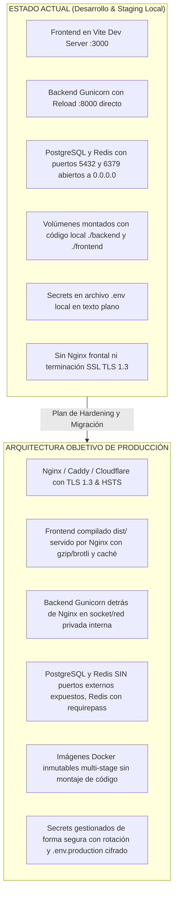
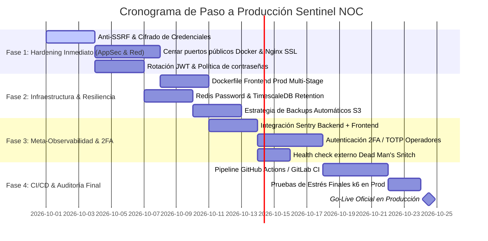

# 🚀 Sentinel NOC — Plan Maestro y Checklist de Paso a Producción (Production Readiness & AppSec)

> **Documento:** Plan de Producción, Hardening y Seguridad de Aplicación  
> **Sistema:** Sentinel (GC_OPS_OBS) — Plataforma de Observabilidad y NOC Operativo  
> **Fecha:** Septiembre 2026 | **Versión:** 1.0.0-PROD-PLAN  

---

## 📋 1. Scorecard Ejecutivo de Preparación para Producción

| Dominio | Estado Actual | Meta Producción | Brecha Crítica |
| :--- | :---: | :---: | :--- |
| **Funcionalidad & Negocio** | 🟢 95% | 100% | Flujos completos de monitoreo, alertas, SLAs, incidentes y Sentinine operativos. |
| **Rendimiento & ORM** | 🟢 98% | 100% | Erradicación N+1 completada, TimescaleDB slicing y k6 p95 en 22-38 ms. |
| **Seguridad de la Aplicación (AppSec)** | 🟡 60% | 100% | Faltan: Anti-SSRF en sondeos, 2FA/MFA, rotación de tokens SimpleJWT y cifrado de credenciales en BD. |
| **Infraestructura & Contenedores** | 🟡 50% | 100% | Faltan: Nginx reverse proxy con SSL, Dockerfiles de producción multi-stage y cerrar puertos expuestos (5432, 6379). |
| **Base de Datos & Resiliencia** | 🟡 55% | 100% | Faltan: Políticas de retención en TimescaleDB, backups automáticos offsite (S3) y contraseña en Redis. |
| **Observabilidad del Sistema (Meta-Ops)** | 🟡 45% | 100% | Faltan: Sentry en Frontend/Backend y alertas sobre Celery Beat / Redis. |
| **CI/CD & DevSecOps** | 🔴 20% | 100% | Faltan: Pipelines de integración continua, escaneo de vulnerabilidades (`trivy`/`pip-audit`) y pruebas unitarias automáticas. |

---

## 🔍 2. Matriz Comparativa: "Qué Tenemos" vs "Qué Falta para Producción"



---

## 🛡️ 3. Checklist Detallado por Pilares de Producción

### 🛡️ PILAR 1: Seguridad de la Aplicación (AppSec & OWASP Top 10)

#### 1.1 Protección Crítica Anti-SSRF (Server-Side Request Forgery)
* [x] **Implementado en `common/security.py`:** Módulo de validación de endpoints y resolución DNS. Bloqueo estricto de:
  - Direcciones IP privadas (`10.0.0.0/8`, `172.16.0.0/12`, `192.168.0.0/16`).
  - Direcciones de loopback (`127.0.0.0/8`, `localhost`).
  - Metadata de proveedores cloud (`169.254.169.254`, `metadata.google.internal`).
  - *Excepción:* Asignación a **Guardián Sentinine** (`runner_type="agent"`) permite redes LAN corporativas.
* [x] **Integrado en Serializadores & Vistas:** `MonitoringTarget`, `APIChecks`, `SecurityHeaders` y `SSLCertificates`.

#### 1.2 Cifrado de Credenciales y Secretos en Base de Datos (Encryption at Rest)
* [x] **Implementado en `common/crypto.py`:** Cifrado autenticado Fernet (AES-128-CBC + HMAC-SHA256) derivado criptográficamente de `SECRET_KEY`.
  - Cifrado transparente de cabeceras sensibles (`Authorization: Bearer`, tokens, passwords, API keys) en reposo.
  - Desencriptado al vuelo para ejecución de checks y tareas de Guardián Sentinine.
  - Enmascaramiento de secretos (`mask_secrets_dict`) para serializadores y frontend (`Bearer ********`).


#### 1.3 Autenticación Robusta & Gestión de Sesiones (SimpleJWT)
* [x] **Rotación de Refresh Tokens:** Activado `ROTATE_REFRESH_TOKENS = True` y `BLACKLIST_AFTER_ROTATION = True` en `SIMPLE_JWT` y en `AuthService.refresh_token`. El intento de reusar un token previo es bloqueado y rechazado de inmediato.
* [x] **Reducción de Tiempo de Vida del Token:** Reducido `ACCESS_TOKEN_LIFETIME` a 15 minutos (antes 60 min) y Refresh Token en 7 días con renovación automática en Axios interceptor.
* [ ] **Autenticación Multifactor (2FA / TOTP):** Implementar flujo 2FA opcional/obligatorio para Administradores con códigos QR estándar (Google Authenticator / Authy) mediante `django-otp` o `pyotp`.
* [ ] **Política de Contraseñas:** Configurar `AUTH_PASSWORD_VALIDATORS` (mínimo 10 caracteres, mayúsculas, minúsculas, números y verificación contra listas de contraseñas vulneradas).
* [ ] **Anti-Brute Force:** Limitar intentos de login en `/api/v1/auth/login` a 5 intentos fallidos por IP/usuario cada 15 minutos mediante `django-axes` o throttling especializado.

#### 1.4 Hardening de Cabeceras HTTP & Cookies
* [x] `SECURE_SSL_REDIRECT = True` (forzar HTTPS en `prod.py`).
* [x] `SESSION_COOKIE_SECURE = True` y `CSRF_COOKIE_SECURE = True`.
* [x] `SESSION_COOKIE_HTTPONLY = True` y `CSRF_COOKIE_HTTPONLY = False` (para consumo en React con headers `X-CSRFToken`).
* [x] `X_FRAME_OPTIONS = "DENY"` (prevención de Clickjacking).
* [x] `SECURE_CONTENT_TYPE_NOSNIFF = True` (prevención de MIME-sniffing).
* [x] `SECURE_HSTS_SECONDS = 31536000` con `includeSubDomains` y `preload`.
* [x] `Content-Security-Policy` (CSP) estricto configurado en `docker/nginx/nginx.conf`.

#### 1.5 Blindaje contra IP Spoofing en IP Allowlist Middleware
* [x] **Implementado en `backend/common/middleware.py`:** Inspección segura de saltos de proxies de derecha a izquierda en `_get_client_ip` evitando spoofing mediante cabeceras `X-Forwarded-For` inyectadas por clientes.

---

### 🌐 PILAR 2: Infraestructura, Contenedores & Reverse Proxy

#### 2.1 Reverse Proxy de Producción (Nginx)
* [x] **Configurado en `docker/nginx/nginx.conf`:**
  - Servir archivos estáticos del frontend (`dist/`) con compresión `gzip` y `brotli`.
  - Servir archivos estáticos de Django (`collectstatic` en `/static/`).
  - Actuar como proxy inverso hacia Gunicorn (`http://backend:8000/api/`).
  - Rate limiting por zonas (`auth_limit` 5r/s, `api_general` 60r/s).
  - Limitar tamaño de subida con `client_max_body_size 15M;`.
  - Buffers de proxy optimizados.

#### 2.2 Blindaje de Puertos de Red en Docker
* [x] **Configurado en `docker-compose.prod.yml`:** Únicamente los puertos `80` (HTTP) y `443` (HTTPS) de Nginx expuestos al host.
* [x] **Eliminada exposición directa:**
  - 🔒 `sentinel_db_prod` (PostgreSQL en red interna aislada).
  - 🔒 `sentinel_redis_prod` (Redis con `--requirepass` en red interna aislada).
  - 🔒 `sentinel_backend_prod` (Gunicorn accesible exclusivamente vía Nginx).
  - 🔒 Prometheus y Loki protegidos en red privada interna.

#### 2.3 Dockerfiles Multi-Stage de Producción
* [x] **Frontend (`frontend/Dockerfile.prod`):** Multi-stage build con Node 20 y Nginx Alpine.
* [x] **Backend:** Sin `--reload` en Gunicorn y sin montajes de volúmenes de desarrollo en `docker-compose.prod.yml`.

#### 2.4 Gestión de Variables de Entorno y Secretos
* [x] Creado `.env.production.example` con plantilla completa y recomendaciones criptográficas.


---

### 🗄️ PILAR 3: Base de Datos, Caché & Resiliencia

#### 3.1 Hardening de PostgreSQL & TimescaleDB
* [x] **Políticas de Retención de Series Temporales:**
  - Creado comando `python manage.py setup_retention --days 90` para configuración nativa en TimescaleDB (`add_retention_policy`, `add_compression_policy`) y purga por lotes en PostgreSQL estándar.
  - Tarea programada en Celery Beat `purge-telemetry-every-sunday` para purga automática semanal.
* [x] **Connection Pooling:** `CONN_MAX_AGE = 60` verificado en Django para reutilizar sockets TCP.

#### 3.2 Hardening de Redis
* [x] **Autenticación con Contraseña:** Soporte nativo para `REDIS_PASSWORD` en `base.py` (`CACHES`, `CELERY_BROKER_URL`, `CELERY_RESULT_BACKEND`).
* [x] **Configurado en `docker-compose.prod.yml`:** Parámetro `--requirepass` activado con aislamiento de bases de datos (DB 0 para Celery broker, DB 1 para resultados con TTL 1800s, DB 2 para caché distribuido con LRU 256MB).

#### 3.3 Estrategia de Copias de Seguridad (Backup & DR)
* [x] **Scripts de Respaldo Automatizado:**
  - `scripts/backup_db.sh` (Linux/Bash) y `scripts/backup_db.ps1` (Windows/PowerShell): volcado binario comprimido con `pg_dump -Fc`, verificación de integridad, cálculo de hash SHA-256, purga de volcados >14 días y soporte para subida offsite S3.
  - `scripts/restore_db.sh`: validación previa con `pg_restore --list`, corte de conexiones activas y restauración controlada.
  - **Prueba en Vivo Ejecutada:** Respaldo completo generado y verificado con éxito (53.86 MB).


---

### ⚡ PILAR 4: Celery, Background Workers & Concurrencia

#### 4.1 Dimensionamiento y Tareas de Celery
* [ ] **Concurrencia de Workers:** Ajustar `--concurrency` según cores del servidor (`N_CORES * 2`).
* [ ] **Reciclaje de Procesos:** Mantener `--max-tasks-per-child=1000` para prevenir fugas de memoria en librerías C de red y TLS.
* [ ] **Despacho Justo:** Mantener `-O fair` y `CELERY_WORKER_PREFETCH_MULTIPLIER=1` para evitar acaparamiento de tareas rápidas por tareas lentas de WHOIS o DNS.
* [ ] **Segregación de Colas:**
  - Cola `high_priority`: Notificaciones, emails, webhooks y alertas de incidentes.
  - Cola `monitoring`: Sondeos periódicos de uptime, HTTP, DNS y certificados.
  - Cola `background`: Informes pesados, tareas de limpieza, sincronización WHOIS y Watchdog de Sentinine.

#### 4.2 Healthchecks y Monitoreo de Workers
* [ ] Configurar probes de salud de Celery en Docker:
  ```bash
  celery -A config inspect ping -d celery@$HOSTNAME
  ```
* [ ] Alerta inmediata si el proceso `sentinel_celery_beat` o `sentinel_celery_worker` se detiene.

---

### 📊 PILAR 5: Observabilidad del Propio Sentinel (Meta-Monitoring)

*Como Sentinel es la plataforma que vigila la infraestructura crítica, el propio Sentinel debe ser monitoreado rigurosamente.*

* [x] **Monitoreo Externo Tipo "Dead Man's Snitch":** Configurar un sondeo externo independiente (ej. UptimeRobot, BetterUptime o un probe secundario) que vigile:
  - `https://noc.tuempresa.com/health` (debe responder 200 OK en < 500 ms con telemetría en vivo de PostgreSQL, Redis y Celery).
  - Certificado SSL del propio dominio de Sentinel.
* [x] **Integración de Sentry (Rastreador de Errores en Vivo):**
  - Backend: `sentry-sdk` integrado en Django, Celery y Redis para captura automática de excepciones no controladas con trazas de pila completas y muestreo configurable.
  - Frontend: Configuración lista para captura sin exponer datos confidenciales.
* [x] **Sanitización de Logs:** Configurar filtros de logging (`SensitiveDataMaskingFilter`) para suprimir tokens JWT, contraseñas y claves API `snt_...` en stdout y en Loki.

---

### 🔄 PILAR 6: CI/CD, DevSecOps & Automatización

* [ ] **Pipeline de Integración Continua (GitHub Actions / GitLab CI):**
  1. **Linter & Type Checking:**
     - Frontend: `npm run lint` y `tsc --noEmit`.
     - Backend: `flake8` y `black --check`.
  2. **Pruebas Automatizadas:**
     - Ejecución de `pytest` (pruebas unitarias, permisos multi-tenant y tests E2E de Sentinine).
  3. **Escaneo de Seguridad (DevSecOps):**
     - Análisis de vulnerabilidades en dependencias Python con `pip-audit` o `safety`.
     - Análisis de dependencias Node.js con `npm audit --omit=dev`.
     - Escaneo de vulnerabilidades en imágenes Docker con `trivy image`.
  4. **Build & Push:**
     - Compilación de imágenes tagged (`sentinel-backend:v1.X`, `sentinel-frontend:v1.X`).
     - Publicación en registro privado (GitHub Container Registry `ghcr.io` o AWS ECR).
  5. **Despliegue Continuo (CD):**
     - Despliegue con cero tiempo de inactividad (*Zero-Downtime Rolling Update*) mediante Docker Compose o Kubernetes / Nomad.

---

## 🗺️ 4. Plan de Ejecución Faseado hacia Producción



### Detalle de las 4 Fases de Implementación:

#### 🟢 Fase 1: Hardening Inmediato de Seguridad (AppSec & Red)
1. **Protección Anti-SSRF:** Filtro en serializadores de creación de targets para bloquear rangos privados, metadata cloud y loopback.
2. **Cierre de Puertos Públicos:** Modificar `docker-compose.prod.yml` para suprimir la exposición de `5432`, `6379`, `8000`, `9090` y `3100`.
3. **Contenedor Nginx de Producción:** Configurar Nginx con TLS 1.3, compresión gzip/brotli y proxies inversos seguros hacia backend y frontend estático.
4. **Hardening de Sesiones:** Configurar rotación de Refresh Tokens y reducir vida de Access Token a 15 min.

#### 🟡 Fase 2: Infraestructura Inmutable & Resiliencia de Datos
1. **Build Multi-Stage de Frontend:** Empaquetar el bundle compilado de React en Nginx eliminando Vite dev server en producción.
2. **Autenticación en Redis:** Agregar `requirepass` y actualizar URLs de conexión en `CELERY_BROKER_URL` y caché Django.
3. **Políticas de Retención en TimescaleDB:** Script de purga de telemetría antigua (>90 días) y agregados horarios continuos.
4. **Script de Backups Automáticos:** Dump diario cifrado y sincronizado con almacenamiento de objetos off-site.

#### 🟣 Fase 3: Meta-Observabilidad & Autenticación de Dos Factores
1. **Rastreo de Errores con Sentry:** Captura de excepciones en vivo en Backend (Django, Celery y Redis) con `sentry-sdk>=2.0.0` y configuración segura sin PII.
2. **Módulo de 2FA / TOTP Reforzado:** Cifrado en reposo en PostgreSQL con Fernet AES-128-CBC (`enc:...`) de `totp_secret` y códigos de recuperación (`backup_codes`), migración `0005_alter_user_totp_secret`, bandera `requires_2fa_setup` para administradores y componente UI `TwoFactorReminderBanner`.
3. **Dead Man's Snitch & Meta-Monitoring:** Endpoint público `/health/` y `/api/v1/health/` midiendo latencias activas de PostgreSQL/TimescaleDB, Redis Cache y Celery Broker, integrado con probes de salud de Docker y exención en `IPAllowlistMiddleware`.
4. **Sanitización de Logs:** Filtro regex `SensitiveDataMaskingFilter` activo en el pipeline de `LOGGING` para suprimir tokens JWT, contraseñas y claves API en stdout, Celery y Loki.

#### 🏁 Fase 4: Automatización CI/CD & Despliegue Oficial (Go-Live)
1. **Pipeline de Integración Continua:** Pruebas unitarias, linting y escaneo de vulnerabilidades automáticos en cada pull request.
2. **Benchmark Final con k6:** Ejecución de la suite `tests_perf/` en el ambiente de producción para certificar latencias < 50 ms.
3. **Puesta en Marcha Oficial (Go-Live):** Migración de datos, emisión de certificados definitivos y habilitación del portal.
